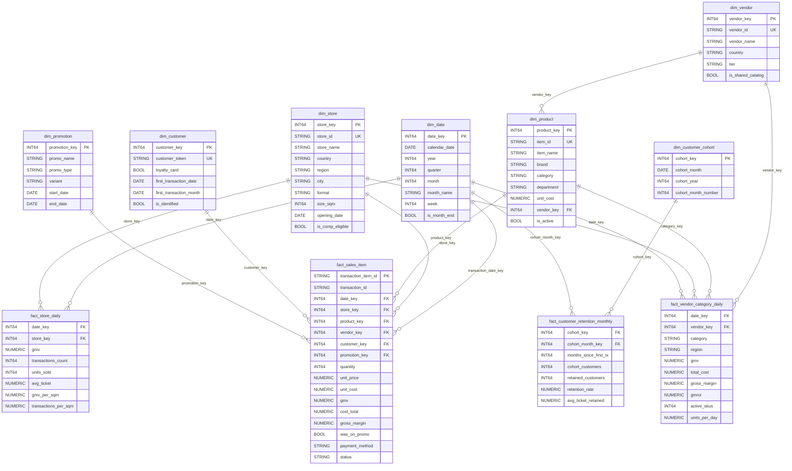
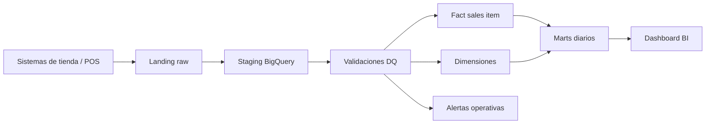

# Bloque 2 — Modelo dimensional, pipeline y gobernanza

**Dataset base:** `transactions`, `transaction_items`, `stores`, `products`, `vendors`, `store_promotions`  
**Plataforma objetivo:** BigQuery  
**Entregables:** `bloque2_modelo.pdf` y `bloque2_decisiones.md`

---

## A. Modelo dimensional

### Objetivo analítico

Diseñar un **Star Schema en BigQuery** que soporte los principales casos de uso retail:

1. **Comp Sales** por tienda, formato, país y período.
2. **GMROI** por proveedor, categoría y región.
3. **Retención de clientes** por cohorte.
4. **Productividad de tienda** por metro cuadrado.
5. **Análisis de promociones** por categoría, tienda y período.

El modelo parte del dataset operacional actual y propone una capa dimensional analítica encima. Las tablas actuales funcionan como fuentes/staging y las tablas dimensionales/fact se usan para consumo de BI.

---

## Diagrama del modelo

---

## Tablas de dimensiones

### `dim_date`

Dimensión calendario para analizar períodos, YoY, trimestres, meses y cohortes.

| Campo | Tipo | Descripción |
|---|---|---|
| `date_key` | INT64 | Clave surrogate, formato recomendado `YYYYMMDD`. |
| `calendar_date` | DATE | Fecha natural. |
| `year` | INT64 | Año calendario. |
| `quarter` | INT64 | Trimestre calendario. |
| `month` | INT64 | Mes numérico. |
| `month_name` | STRING | Nombre del mes. |
| `week` | INT64 | Semana del año. |
| `is_month_end` | BOOL | Flag para cierres mensuales. |

### `dim_store`

Derivada de `stores.csv`. Permite análisis por tienda, país, región y formato.

| Campo | Tipo | Descripción |
|---|---|---|
| `store_key` | INT64 | Clave surrogate. |
| `store_id` | STRING | Clave natural del sistema fuente. |
| `store_name` | STRING | Nombre de tienda. |
| `country` | STRING | País. |
| `region` | STRING | Región operativa. |
| `city` | STRING | Ciudad. |
| `format` | STRING | Formato: hipermercado, supermercado, descuento, etc. |
| `size_sqm` | INT64 | Tamaño en metros cuadrados. |
| `opening_date` | DATE | Fecha de apertura. |
| `is_comp_eligible` | BOOL | Flag calculado para tiendas comparables, abierto al menos 13 meses. |

### `dim_product`

Derivada de `products.csv`. Incluye categoría, departamento, costo y relación con proveedor.

| Campo | Tipo | Descripción |
|---|---|---|
| `product_key` | INT64 | Clave surrogate. |
| `item_id` | STRING | Clave natural del producto. |
| `item_name` | STRING | Nombre del producto. |
| `brand` | STRING | Marca. |
| `category` | STRING | Categoría comercial. |
| `department` | STRING | Departamento. |
| `unit_cost` | NUMERIC | Costo unitario vigente para análisis de margen. |
| `vendor_key` | INT64 | FK a `dim_vendor`. |
| `is_active` | BOOL | Producto activo en ventas recientes. |

### `dim_vendor`

Derivada de `vendors.csv`. Soporta GMROI por proveedor.

| Campo | Tipo | Descripción |
|---|---|---|
| `vendor_key` | INT64 | Clave surrogate. |
| `vendor_id` | STRING | Clave natural del proveedor. |
| `vendor_name` | STRING | Nombre del proveedor. |
| `country` | STRING | País del proveedor. |
| `tier` | STRING | Nivel comercial. |
| `is_shared_catalog` | BOOL | Indica si comparte catálogo. |

### `dim_customer`

Dimensión protegida para clientes identificados. No almacena `customer_id` en claro.

| Campo | Tipo | Descripción |
|---|---|---|
| `customer_key` | INT64 | Clave surrogate. |
| `customer_token` | STRING | Hash/token irreversible del `customer_id`. |
| `loyalty_card` | BOOL | Indicador de tarjeta de lealtad. |
| `first_transaction_date` | DATE | Primera compra identificada. |
| `first_transaction_month` | DATE | Mes de cohorte. |
| `is_identified` | BOOL | TRUE si tiene customer identificado. |

### `dim_promotion`

Derivada de `store_promotions.csv` y de `was_on_promo` en `transaction_items`.

| Campo | Tipo | Descripción |
|---|---|---|
| `promotion_key` | INT64 | Clave surrogate. |
| `promo_name` | STRING | Nombre de la promoción. |
| `promo_type` | STRING | Tipo de promoción. |
| `variant` | STRING | CONTROL, TREATMENT u otra variante. |
| `start_date` | DATE | Inicio. |
| `end_date` | DATE | Fin. |

### `dim_customer_cohort`

Dimensión liviana para análisis de retención.

| Campo | Tipo | Descripción |
|---|---|---|
| `cohort_key` | INT64 | Clave surrogate. |
| `cohort_month` | DATE | Mes de primera transacción. |
| `cohort_year` | INT64 | Año de cohorte. |
| `cohort_month_number` | INT64 | Mes numérico de cohorte. |

---

## Tablas de hechos

### `fact_sales_item`

Grano: **una línea de ticket por producto vendido** (`transaction_item_id`).  
Es la tabla central para GMV, margen, promociones, GMROI y basket analysis.

| Campo | Tipo | Descripción |
|---|---|---|
| `transaction_item_id` | STRING | Identificador único de línea de transacción. |
| `transaction_id` | STRING | Identificador del ticket. |
| `date_key` | INT64 | FK a `dim_date`. |
| `store_key` | INT64 | FK a `dim_store`. |
| `product_key` | INT64 | FK a `dim_product`. |
| `vendor_key` | INT64 | FK a `dim_vendor`. |
| `customer_key` | INT64 | FK a `dim_customer`; puede apuntar a cliente anónimo. |
| `promotion_key` | INT64 | FK a `dim_promotion`; puede apuntar a sin promoción. |
| `quantity` | INT64 | Unidades vendidas. |
| `unit_price` | NUMERIC | Precio unitario de venta. |
| `unit_cost` | NUMERIC | Costo unitario. |
| `gmv` | NUMERIC | `quantity * unit_price`. |
| `cost_total` | NUMERIC | `quantity * unit_cost`. |
| `gross_margin` | NUMERIC | `gmv - cost_total`. |
| `was_on_promo` | BOOL | Flag de promoción a nivel línea. |
| `payment_method` | STRING | Método de pago del ticket. |
| `status` | STRING | Estado de transacción. |

### `fact_store_daily`

Grano: **una tienda por día**.  
Optimiza dashboards de productividad, comp sales y monitoreo operativo.

| Campo | Tipo | Descripción |
|---|---|---|
| `date_key` | INT64 | FK a `dim_date`. |
| `store_key` | INT64 | FK a `dim_store`. |
| `gmv` | NUMERIC | GMV diario. |
| `transactions_count` | INT64 | Tickets diarios. |
| `units_sold` | INT64 | Unidades vendidas. |
| `avg_ticket` | NUMERIC | GMV / transacciones. |
| `gmv_per_sqm` | NUMERIC | GMV / m². |
| `transactions_per_sqm` | NUMERIC | Transacciones / m². |

### `fact_customer_retention_monthly`

Grano: **cohorte por mes relativo desde primera compra**.  
Soporta retención M1, M2, M3 y M6 sin recalcular sobre tickets crudos cada vez.

| Campo | Tipo | Descripción |
|---|---|---|
| `cohort_key` | INT64 | FK a `dim_customer_cohort`. |
| `cohort_month_key` | INT64 | FK a `dim_date` para el mes de cohorte. |
| `months_since_first_tx` | INT64 | Mes relativo: 0, 1, 2, 3, 6, etc. |
| `cohort_customers` | INT64 | Clientes únicos en cohorte. |
| `retained_customers` | INT64 | Clientes que volvieron en el mes relativo. |
| `retention_rate` | NUMERIC | `retained_customers / cohort_customers`. |
| `avg_ticket_retained` | NUMERIC | Ticket promedio de clientes retenidos. |

### `fact_vendor_category_daily`

Grano: **vendor + categoría + región + día**.  
Optimiza GMROI y performance comercial por proveedor.

| Campo | Tipo | Descripción |
|---|---|---|
| `date_key` | INT64 | FK a `dim_date`. |
| `vendor_key` | INT64 | FK a `dim_vendor`. |
| `category` | STRING | Categoría del producto. |
| `region` | STRING | Región derivada de tienda. |
| `gmv` | NUMERIC | Venta bruta. |
| `total_cost` | NUMERIC | Costo total. |
| `gross_margin` | NUMERIC | Margen bruto. |
| `gmroi` | NUMERIC | `gross_margin / total_cost`. |
| `active_skus` | INT64 | SKUs con venta. |
| `units_per_day` | NUMERIC | Velocidad de venta diaria. |

---

## Justificación de decisiones de diseño

### 1. Separar ventas en `fact_sales_item` y agregados diarios en marts

El grano más detallado disponible es la línea de ticket (`transaction_items`). Usarlo como hecho principal evita perder información necesaria para:

- GMROI por producto/vendor/categoría.
- Impacto de promociones por ítem.
- Margen bruto calculado con costo unitario.
- Basket analysis.

Sin embargo, dashboards ejecutivos no deberían recalcular todo desde líneas crudas cada vez. Por eso se propone `fact_store_daily` y `fact_vendor_category_daily` como hechos agregados. Es menos glamoroso que consultar todo en vivo, pero mucho más barato y menos propenso a romperse un lunes a las 8:59.

### 2. Modelar el 60% de transacciones sin `customer_id`

Como aproximadamente el 60% de las transacciones no tiene `customer_id`, no se debe forzar imputación ni inventar clientes. La decisión correcta es:

- Crear un registro técnico en `dim_customer` para clientes anónimos, por ejemplo `customer_key = -1`.
- Mantener `is_identified = FALSE` para esas ventas.
- Excluir clientes anónimos de cohortes y retención.
- Incluirlos en GMV, productividad, promociones y métricas de tienda.

Esto conserva integridad referencial sin distorsionar análisis de retención. Inventar IDs para clientes no identificados sería bonito para el dashboard y terrible para la verdad. Perrito no aprueba.

### 3. Usar claves surrogate además de claves naturales

Las tablas fuente usan claves naturales como `store_id`, `item_id`, `vendor_id` y `customer_id`. En el modelo dimensional se agregan surrogate keys (`store_key`, `product_key`, `vendor_key`, etc.) para:

- Aislar el modelo analítico de cambios en sistemas fuente.
- Permitir Slowly Changing Dimensions si cambian atributos como formato, región, categoría o proveedor.
- Mejorar consistencia en joins y particionamiento/clustering.

Las claves naturales se conservan como columnas de auditoría y trazabilidad.

### 4. Mantener promoción como dimensión y flag transaccional

`was_on_promo` existe a nivel línea de ticket, mientras `store_promotions` describe promociones por tienda y rango de fechas. Por eso se modela:

- `was_on_promo` en `fact_sales_item` para análisis directo línea por línea.
- `dim_promotion` para atributos de campaña, variante, tipo y vigencia.

Esto permite medir tanto uplift transaccional como performance de campañas tipo CONTROL/TREATMENT.

### 5. Materializar hechos agregados para performance y consistencia

Comp Sales, productividad y GMROI se consultan recurrentemente. Materializar agregados diarios evita que cada reporte defina GMV, fechas y filtros a su manera. Un solo cálculo certificado reduce el clásico problema corporativo: “mi reporte dice 100 y el tuyo 103, ¿quién miente?”. La respuesta suele ser: los dos filtraron distinto.

---

# B. Diseño del pipeline ETL/ELT

## Enfoque general

Se recomienda un pipeline **ELT en BigQuery** con capas:

1. **Landing / raw:** archivos o eventos tal como llegan desde tiendas.
2. **Staging:** tipado, normalización y validaciones básicas.
3. **Core dimensional:** dimensiones y hechos al grano definido.
4. **Marts certificados:** agregados diarios para dashboards.
5. **Data quality / observabilidad:** métricas de frescura, duplicados y reconciliación.

Flujo recomendado:

---

## ¿Cómo manejar tiendas que reportan ventas con hasta 2 horas de retraso?

Usaría una estrategia de **watermark con ventana de tolerancia**:

- El pipeline no considera cerrado el día o la hora inmediatamente al recibir datos.
- Se reprocesa una ventana móvil reciente, por ejemplo las últimas 3 a 4 horas.
- Para el cierre diario, se define un corte operativo después de la hora esperada de llegada más margen, por ejemplo D+1 a las 03:00.
- Los datos tardíos actualizan las tablas mediante `MERGE`, no mediante append ciego.

Ejemplo conceptual:

- Dashboard diario refresca temprano en la mañana.
- Datos del día D se consideran completos cuando todas las tiendas esperadas enviaron o cuando se supera el SLA de latencia.
- Si llega una venta tarde, se reprocesa solo la partición afectada.

---

## ¿Cómo detectar automáticamente que una tienda dejó de enviar datos?

Implementaría una tabla de control de frescura por tienda:

`monitoring_store_freshness`

| Campo | Descripción |
|---|---|
| `store_id` | Tienda monitoreada. |
| `last_transaction_timestamp` | Última transacción recibida. |
| `expected_frequency_minutes` | Frecuencia esperada de recepción. |
| `minutes_since_last_sale` | Minutos desde última venta. |
| `historical_avg_transactions_same_hour` | Promedio histórico para esa tienda/día/hora. |
| `freshness_status` | OK, WARNING, CRITICAL. |

Reglas sugeridas:

- **WARNING:** no hay datos por más de 90 minutos en horario operativo.
- **CRITICAL:** no hay datos por más de 2 horas y el histórico indica ventas normales en ese horario.
- Excluir horarios donde la tienda está cerrada o no debería operar.
- Enviar alerta a Operaciones/DataOps con tienda, país, región y última venta recibida.

La clave es comparar contra calendario operativo e histórico. Si no, una tienda cerrada a medianoche parecería “caída”, y el pipeline quedaría haciendo teatro.

---

## ¿Cómo hacer cargas incrementales sin duplicar transacciones?

Usaría `MERGE` en BigQuery con claves naturales estables:

- Para tickets: `transaction_id`.
- Para líneas: `transaction_item_id`.
- Para agregados diarios: combinación de `date_key + store_key` o `date_key + vendor_key + category + region`.

Estrategia:

1. Cargar datos nuevos a tabla staging particionada por fecha de ingestión.
2. Deduplicar staging usando `ROW_NUMBER()` sobre la clave natural, ordenando por `ingestion_timestamp` descendente.
3. Ejecutar `MERGE` contra la tabla final:
   - `WHEN MATCHED THEN UPDATE` si cambió algún atributo o métrica.
   - `WHEN NOT MATCHED THEN INSERT`.
4. Recalcular marts solo para particiones afectadas.
5. Guardar auditoría de ejecución: filas leídas, insertadas, actualizadas, rechazadas y duplicadas.

Esto evita duplicar transacciones cuando un archivo se reenvía o cuando llegan correcciones.

---

## ¿Con qué frecuencia correría el pipeline si el dashboard necesita refresh diario?

Para un dashboard con refresh diario, correría:

- **Ingesta incremental:** cada 30 a 60 minutos durante horario operativo.
- **Cierre diario certificado:** una vez al día, idealmente D+1 temprano, por ejemplo 03:00 o 04:00.
- **Reproceso de ventana tardía:** incluir D y D-1 para capturar retrasos/correcciones.
- **Data quality checks:** en cada corrida incremental y antes del refresh certificado.
- **Dashboard refresh:** después de completar marts certificados diarios.

Aunque el dashboard sea diario, correr ingesta varias veces al día mejora monitoreo de frescura y reduce el riesgo de descubrir errores hasta el día siguiente. O sea: menos incendio, más jardinería.

---

# C. Gobernanza

## ¿Cómo proteger `customer_id` para cumplir con políticas de privacidad?

Medidas recomendadas:

1. **Tokenización o hashing irreversible**
   - No exponer `customer_id` en claro en capas analíticas.
   - Crear `customer_token` usando hash con sal administrada por plataforma segura.

2. **Separación de datos sensibles**
   - Mantener mapping `customer_id -> customer_token` en zona restringida.
   - Los usuarios BI solo acceden a `customer_key` o `customer_token`.

3. **Control de acceso por rol**
   - Aplicar IAM por dataset, tabla y columna.
   - Usar policy tags en BigQuery para columnas sensibles.

4. **Minimización de datos**
   - Para cohortes solo se requiere cliente pseudonimizado y mes de primera compra.
   - No copiar atributos personales innecesarios.

5. **Auditoría**
   - Registrar accesos a tablas con datos sensibles.
   - Revisar periódicamente permisos y uso.

---

## ¿Quién debería ser el data owner de la tabla de transacciones?

El owner debería ser el área responsable del proceso de negocio que genera y certifica la venta: **Operaciones Retail / POS / Omnicanal transaccional**, dependiendo de la estructura organizacional.

Responsabilidades del data owner:

- Definir significado oficial de GMV, transacción, cancelación y estado válido.
- Aprobar reglas de calidad y corrección.
- Definir SLA de disponibilidad.
- Resolver ambigüedades de negocio.
- Coordinar con Data Engineering para implementación técnica.

Data Engineering puede ser custodio técnico, pero no debería ser el dueño semántico de la venta. El dueño debe ser quien puede decir: “esta venta cuenta” o “esta venta no cuenta”.

---

## Si dos reportes muestran GMV diferente para la misma tienda y el mismo día, ¿cuál sería el proceso para resolverlo?

Proceso recomendado:

1. **Confirmar definición de GMV**
   - ¿Usan `total_amount` del ticket o suma de `quantity * unit_price`?
   - ¿Incluyen impuestos, descuentos, devoluciones o cancelaciones?
   - ¿Filtran solo `COMPLETED`?

2. **Comparar alcance temporal**
   - Validar zona horaria.
   - Confirmar fecha de transacción vs fecha de ingestión.
   - Revisar si uno incluye datos tardíos y otro no.

3. **Reconciliar desde la tabla certificada**
   - Usar `fact_store_daily` como fuente oficial para dashboards.
   - Si hay diferencia, bajar al detalle en `fact_sales_item` y `transactions`.

4. **Identificar diferencia técnica**
   - Duplicados.
   - Transacciones faltantes.
   - Filtros distintos.
   - Reprocesos incompletos.
   - Late arriving data.

5. **Documentar resolución**
   - Registrar causa raíz.
   - Actualizar definición en catálogo de datos.
   - Corregir query o pipeline.
   - Reprocesar particiones afectadas si aplica.

6. **Prevenir repetición**
   - Crear tests de reconciliación diarios.
   - Publicar una métrica certificada de GMV.
   - Bloquear definiciones paralelas en reportes oficiales.

La regla de oro: si dos reportes oficiales calculan GMV distinto, no se elige el más bonito; se rastrea hasta el grano certificado y se corrige la definición o el dato.

---

# Resumen ejecutivo

El diseño propuesto usa un Star Schema con `fact_sales_item` como hecho transaccional principal y marts agregados para productividad, GMROI y retención. Se protege `customer_id` mediante tokenización y se modelan clientes anónimos explícitamente para no contaminar cohortes. El pipeline recomendado usa ELT incremental en BigQuery con `MERGE`, tolerancia a datos tardíos de hasta 2 horas, monitoreo automático por tienda y refresh diario certificado. La gobernanza se apoya en ownership claro, definiciones certificadas de GMV y proceso formal de reconciliación.
